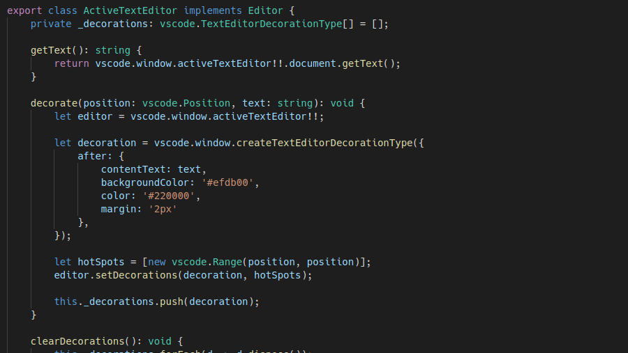
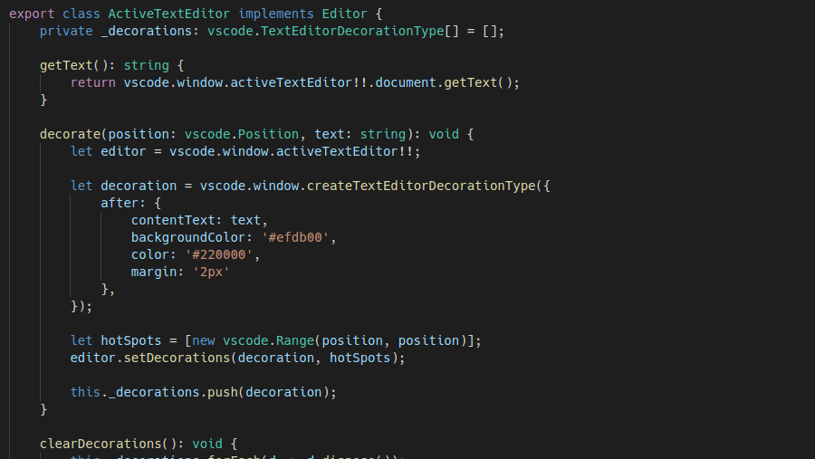

# VisualNav

VisualNav is a Visual Studio code extension providing a "visual navigation" feature, allowing you to quickly jump
between different parts of your code based on their visual location.

In a sense, VisualNav is trying to replace mouse-based navigation, but without requiring you to think *how* to get
to a certain place in the code. You simply "see" where you want to go.

## Installation

The extension is not in the marketplace yet and it's not decided that it ever will. Anyway, you can still install it
using the source code. Simply clone the repository to your extensions directory and build it by running the `compile`
script using yarn/npm.

If you're lazy and happen to have a Linux/Mac machine, the following should work:

```
cd ~/.vscode/extensions/
git clone https://github.com/goyozi/visual-nav.git
cd visual-nav/
yarn run compile
```

## Features

The navigation mode is toggled by pressing `Alt+A` and provides two features:

* jumping to a place in the code by entering the characters shown at desired point:

* scrolling up and down by pressing `f` and `j` respectively



When navigation mode is active, an indicator on the bottom bar shows you the characters you already typed.


## Extension Settings

This extension contributes the following settings:

* `visualNav.minimumGap`: minimum number of characters between navigation points (default: 2)
* `visualNav.scrollStep`: number of lines to scroll up/down in one step (default: 5)

## Known Issues

There are no tests in place yet, so there probably are issues, but I haven't noticed (and not fixed) them yet.

## Release Notes

### 0.0.1

Basic idea working.

**Enjoy!**
